# Kafka

Documentação:

-   [kafjajs](https://kafka.js.org/docs/getting-started)
-   [Cofluent examples](https://github.com/confluentinc/cp-docker-images/tree/5.3.3-post/examples)

## Perguntas

-   Onde salvar os eventos?
-   Como recuperar de forma rápida e simples de forma que o feedback entre um processo e outro ou memos entre um sistema e outro possa acontecer de forma fluída e em tempo real?
-   Como escalar?
-   Como ter resiliência e alta disponibilidade?

## Vantagens

-   Desenvolvido em Java;
-   Opensource;
-   Alta capacidade de processar requisições;
-   Latência extramamente baixa (2ms);
-   Escalável;
-   Armazenamento, as mensagens ficam guardadas, banco de dados otimizado;
-   Alta disponibilidade;
-   Se conecta com quase tudo, existe drivers para várias tecnologias, existem muitas bibliotecas prontas.

## Quem usa?

-   Linkedin;
-   Netflix;
-   Uber;
-   Twitter;
-   Dropbox;
-   Spotify;
-   PayPal;
-   Bancos.

## Como funciona?

-   O produtor envia uma mensagem para o Kafka, que fica armazenado em um broker, que possui um banco de dados próprio, o consumidor por sua vez, realiza a leitura das mensagens nos brokers.

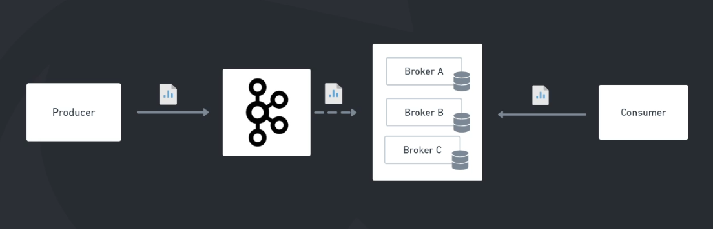

## Tópicos

São canais de comunicações responsáveis por receber e disponibilizar os dados enviados para o Kafka.


Os tópicos podem ser lidos por multiplos sistemas, diferentemente do RabbitMQ que ao ler um tópico, a mensagem é perdida, não podendo ser lido por multiplos sistemas.

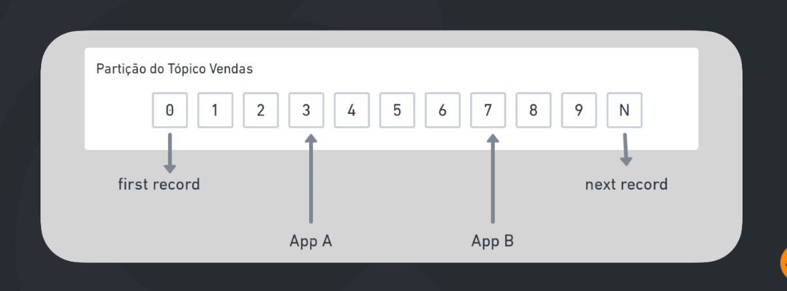

Quando o produtor envia uma mensagem através de um tópico, um id (offset) é atribuido a mensagem e vai sendo salva em disco de forma enfileirada, dessa forma, a mensagem pode ser reprocesada, exemplo, voltar no offset 2 e reprocessar.

### Anatomia de uma mensagem

A mensagem é composta por 4 partes:

-   **Cabeçalho:** metadados
-   **Key:** contexto da mensagem, garante a ordem de entrega da mensagem
-   **Value:** payload, o próprio JSON
-   **Timestamp**

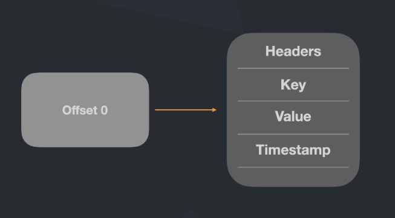

## Partições

Como demonstrado abaixo, cada tópico pode ter uma ou mais partições, garantindo a distribuição e resiliência dos dados.

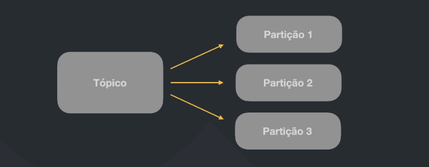

Quando uma mensagem é enviada, através de um tópico, o destino é uma das 3 partições, de acordo com o algoritmo do Kafka (round-robin), como ilustrada na imagem acima, isso garante diversas estratégias para o cosumidor, diminuindo o risco da mensagem ser entregue e aumentando a quantidade de consumidores.

**Exemplo:** uma hipótese de envio de 1500 mensangens, é possível enviar 500 mensagens para a partição 1, 500 para partição 2 e 500 para partição 3, fica mais rápido a leitura pelo consumidor em determinadas partições.

### Partições distribuídas

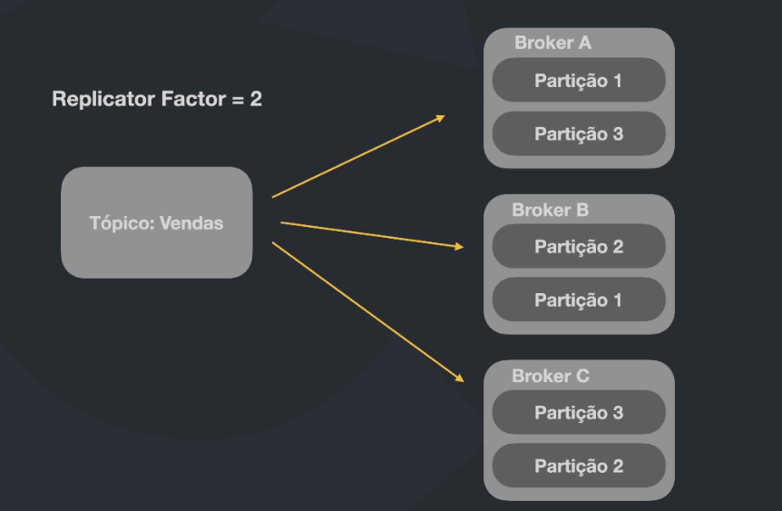

As partições distribuídas garantem resiliência, onde, caso um broker caia, as outras partições terão os backups das mensagens em outros brokers.

-   **Comum:** 2 replicators.
-   **Casos críticos:** 3 replicators.

### Partição líder

Como ilustrado na imagem a baixo, cada broker tem uma partição líder, dessa forma, necessariamente, o cosumidor ler a partição líder.

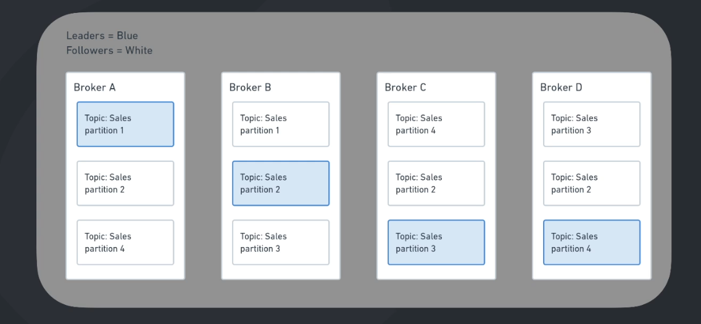

Quando um broker cai, o gerenciador do Kafka elege uma partição líder, como demonstado na imagem abaixo.

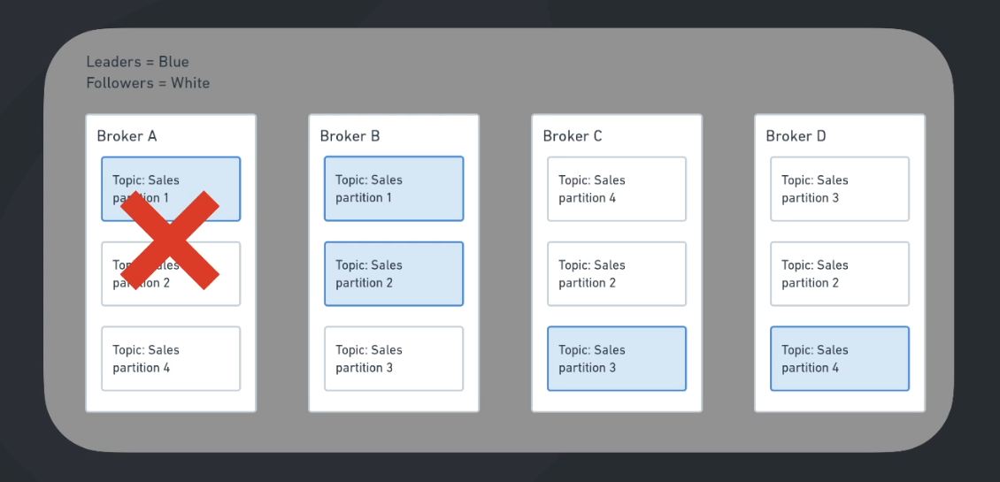

## Keys

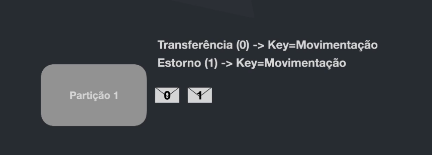

As **keys garantem as ordens de entregas**, alocando as mensagens em uma mesma partição, entretanto se não tiver a necessidade de uma leitura ordenada, apenas basta não informar uma key, que o Kafka irá definir através do seu algoritmo, em qual partição irá ficar aquela mensagem.

## Garantia de entregas

### Producer

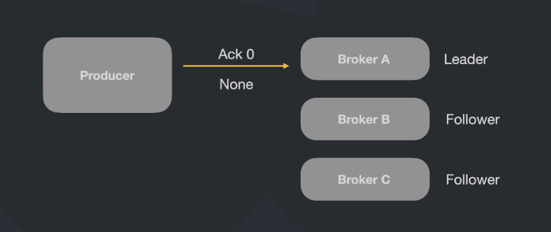

Quando é enviado uma mensagem, sempre é recebido pelo **Leader**, dentro da mensagem é pasado um parametro **Ack**.

-   **Ack=0**: O produtor não recebe uma confirmação do Kafka que a mensagem foi salva, entretanto, como o Kafka não fica a todo tempo notifiando o produtor, se torna mais rápido o processamento de mensagens, é importante estar ciente que ao perder mensagem, ela não não irá fazer falta.

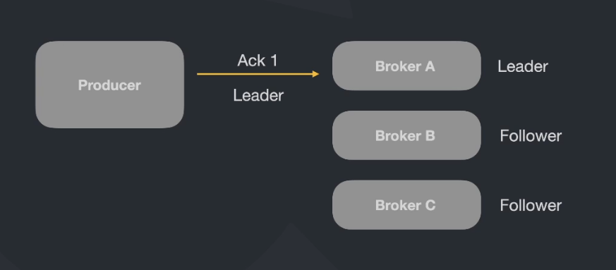

-   **Ack=1:**: O produtor recebe uma confirmação do Kafka que a mensagem foi salva, entretanto se o broker A (Leader) cai e não teve tempo hábil de replicar para os **Followers**, o produtor acredita que a mensagem foi salva, entretanto, a mensagem é perdida.

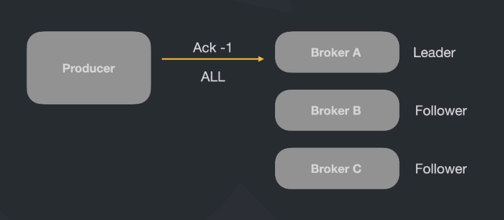

-   **Ack=-1:**: O produtor recebe uma confirmação do Kafka que a mensagem foi salva pelo Leader, que por sua vez, replica as mensagens para os Followers, que por sua vez, notifica ao Leader que as mensagens foram salvas, que por sua vez, notifica ao produtor que a mensagem foi salva, essa é a opção mais segura, entretanto é a mais custosa.

#### Melhor performance

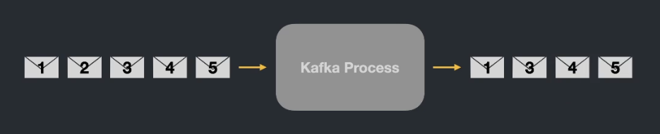

-   **At most once:** Quando as mensagens são enviadas, pode ocorrer perdas de mensages nesse tipo de configuração.

#### Performance moderada

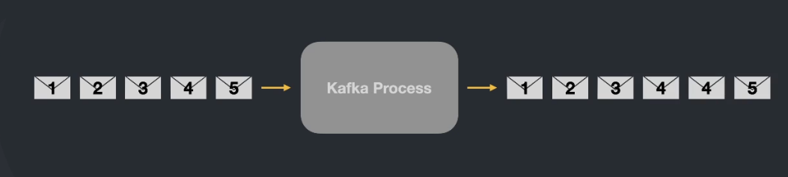

-   **At least once:** Quando as mensagens são enviadas, pode haver duplicações de mensagens, nesse caso há uma necessidade da aplicação realizar o tratamento das duplicações.

#### Pior performance

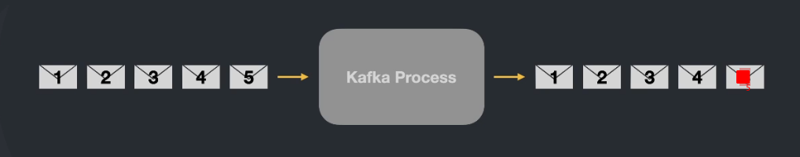

-   **Exacly once:** Nesse tipo de configuração o Kafka garante que não vai ocorrer perdas e duplicações.

### Indepotência do produtor

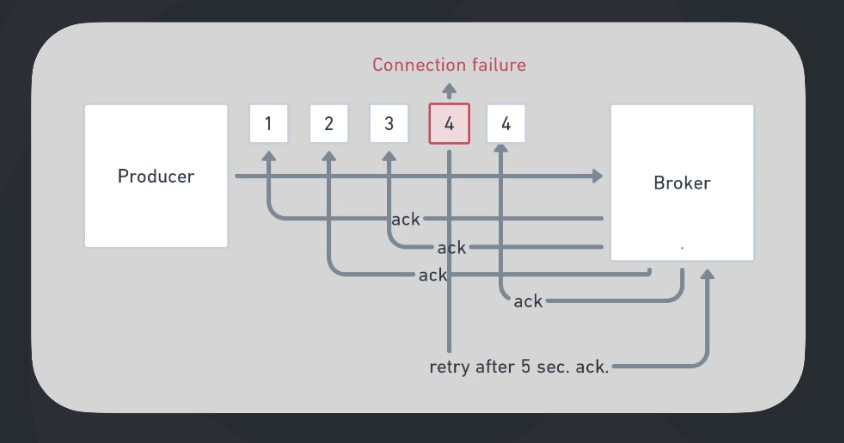

-   **OFF:** O caso acima demonstrado, no envio 4, ocorre uma falha de comunicação de rede e o produtor vai enviar a mensagem novamente, dessa forma, duplicando a mensagem.

-   **ON:** Quando configurado como indepotência on, o Kafka vai perceber o problema e não vai enviar a mensagem novamente, dessa forma, descarta a mensagem e garante a ordem a sua ordem na fila.

## Consumers

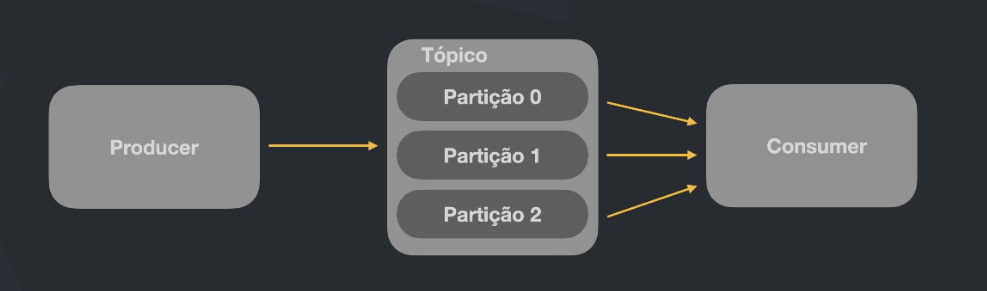

No caso demonstrado acima, temos um tópico com 3 partições e um consumidor lendo das 3 partições, quando um consumidor não está em um grupo, o Kafka considera que esse comsumidor é o próprio grupo.

### Grupos de consumidores

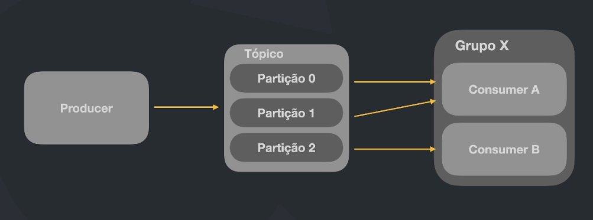

Como demonstrado acima, foi criado um grupo chamado de **Grupo X**, com 2 consumidores e o Kafka se encarrega de realizar a distribuição das leituras.

**Observação:** Caso contenha um terceiro consumidor (c) sem estar dentro do Grupo X, irá ler das 3 partições.

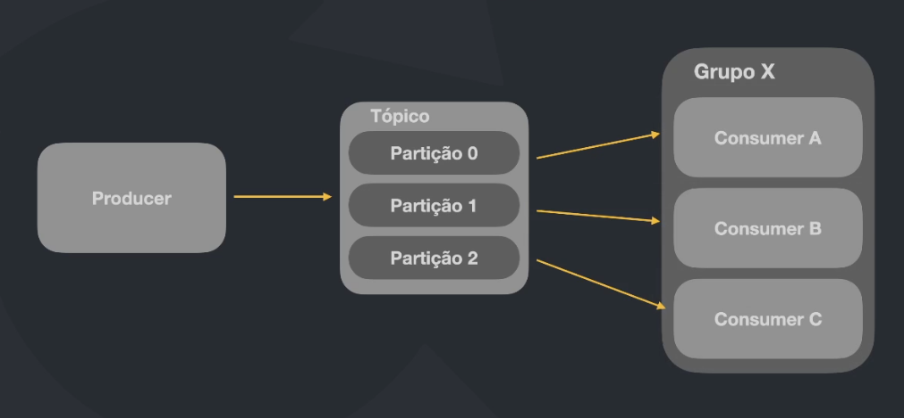

No caso acima, cada consumiror ler uma partição, esse é o melhor caso.

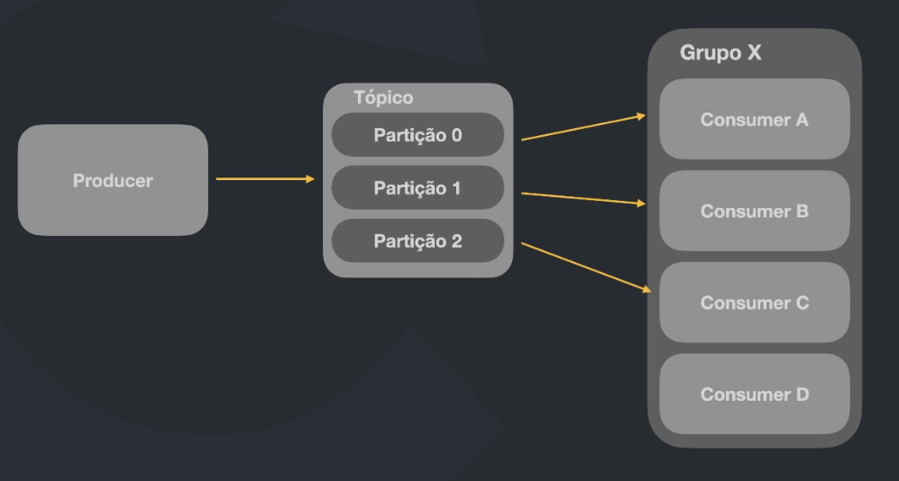

**Observação 1:** Caso contenha um quarto consumidor (d), não vai poder ler nenhuma partição, como demonstrado na imagem acima.

**Observação 2:** Não há possibilidade de 2 consumidores em um mesmo grupo, ler a mesma partição.

## Kafka vs RabbitMQ

O Kafka não trabalha igual ao RabbitMQ, ele salva as mensagens em disco, o RabbitMQ em memória.

## Recomendações mínimas

-   Um cluster com 3 brokers.

## Command line

### Subindo e acessando o container

```bash
# Subindo os containers
docker-compose up -d

# Acessando o container para criar o tópico
docker exec -it customer-clean-architecture_kafka-1_1 bash
```

### Tópicos

```bash
# Listando os tópicos existentes
kafka-topics --list --bootstrap-server localhost:29092

# Criando o tópico
kafka-topics --create --bootstrap-server localhost:29092 --replication-factor 2 --partitions 2 --topic topic-customer

# Exibindo informações do tópico, partições, líderes e réplicas
kafka-topics --describe --bootstrap-server localhost:29092 --topic topic-customer

# Deletando um tópico
kafka-topics --bootstrap-server localhost:29092 --delete --topic topic-customer
```

### Produtor

```bash
# Criando um produtor para um tópico existente (topic-customer)
# Após criar, digite as mensagens a serrem enviadas
# ctrl + c para sair
kafka-console-producer --broker-list localhost:29092 --topic topic-customer
```

### Consumidor

```bash
# Criando um consumidor para um tópico existente (topic-customer)
# --from-beginning (pega as mensagens do início do tópico criado)
# ctrl + c para sair
kafka-console-consumer --bootstrap-server localhost:29092 --from-beginning --topic topic-customer

# Criando um consumidor para o tópico existente com grupo
# ctrl + c para sair
kafka-console-consumer --bootstrap-server localhost:29092 --from-beginning --topic topic-customer --group group-clean
```

### Grupos

```bash
# Listar grupos
kafka-consumer-groups --bootstrap-server localhost:29092 --list

# Exibindo informações sobre os consumidores conetados, patições, offset e lag
kafka-consumer-groups --bootstrap-server localhost:29092 --group group-clean --describe
```

<hr />

<div>
  
  <sub>Made with 💙 by <a href="https://github.com/venzel">Enéas Almeida</a></sub>
</div>
