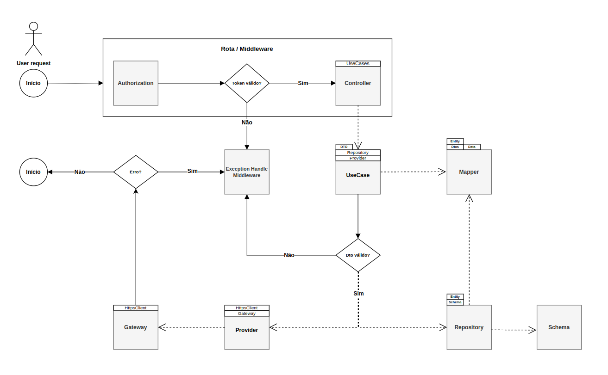
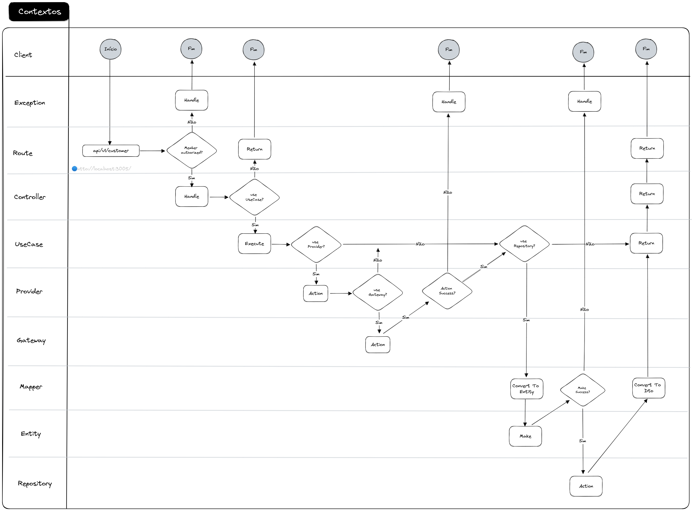
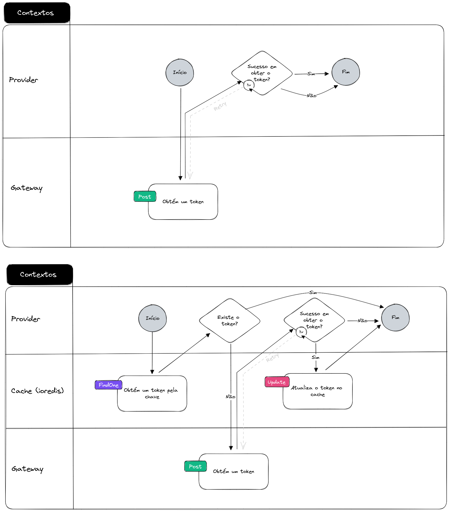
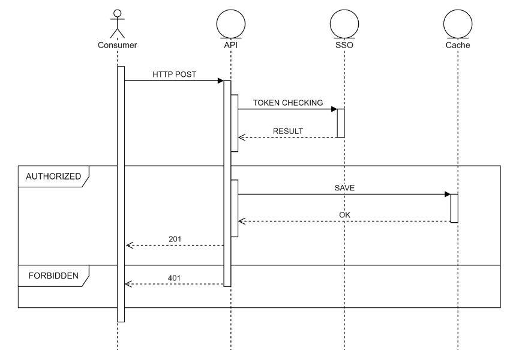
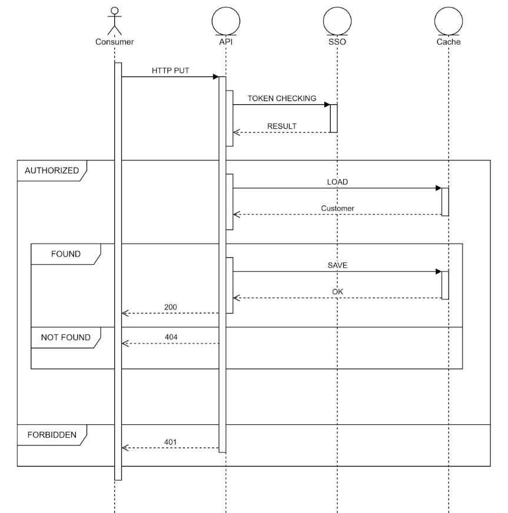
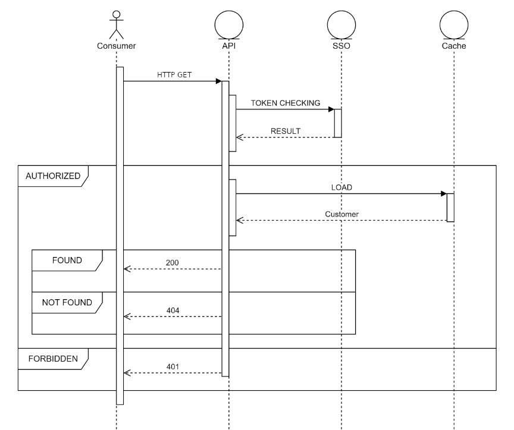
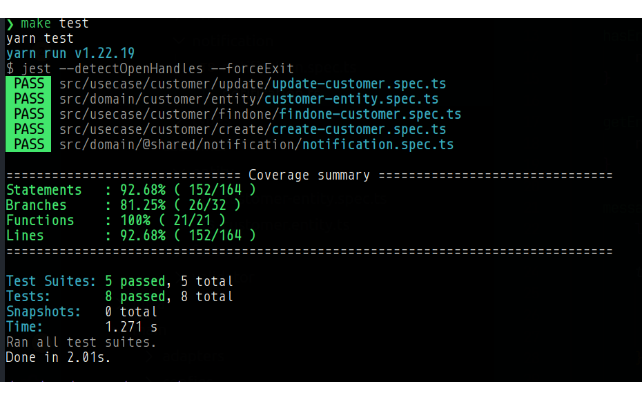

# Customer API (Microserviço)

[](https://github.com/venzel/customer-api/blob/master/LICENSE)

> **Customer API** é um microserviço que utiliza um padrão arquitetural Clean Architecture e modelagem de entidade utilizando conceitos de DDD.

## Stack

-   NodeJs/Express;
-   Typescript;
-   Docker (MongoDB, Redis);
-   Jest;

## Padrão arquitetural (Clean Architecture)

<p align="center">
    
</>

A escolha do padrão **Clean Architecture** para um projeto de software pode trazer diversos benefícios, mas é importante ressaltar que a escolha de uma arquitetura depende muito das necessidades específicas do projeto, das características da equipe de desenvolvimento e das metas a serem alcançadas.

**Principais vantagens:**

-   Separação de responsabilidades;
-   Independência de frameworks e bibliotecas;
-   Testabilidade;
-   Adaptabilidade a mudanças;
-   Escalabilidade;
-   Longevidade do software;
-   Compreensão e colaboração.

## Diagramas BPMN do microserviço



| Descrição          | Data de modificação  | Versão | Link de download                                         |
| :----------------- | :------------------- | :----- | :------------------------------------------------------- |
| Arquivo .drawio v1 | 11 de agosto de 2023 | v1     | [Download](./media/customer-microservico-bpmn.drawio)    |
| Arquivo .drawio v2 | 12 de agosto de 2023 | v2     | [Download](./media/customer-microservico-bpmn-v2.drawio) |



| Descrição          | Data de modificação  | Versão | Link de download                                 |
| :----------------- | :------------------- | :----- | :----------------------------------------------- |
| Arquivo .drawio v1 | 12 de agosto de 2023 | v1     | [Download](./media/customer-v1.excalidraw-v1.md) |

## Metodologia de desenvolvimento

1. Entendimento do problema, escopo e prazos;
2. Levantamento dos requisitos funcionais;
3. Definição do padrão arquitetural a ser utilizado;
4. Definição das atribuições e cronograma de estimativas no desenvolvimento das atividades para cumprimiento dos prazos de entrega;
5. Criação dos diagramas;
6. Desenvolvimento do código, guiado a testes (TDD);
7. Ajustes no código e diagramas.

## Técnicas utilizadas

-   👉 [Modelagem do domínio (DDD)](./src/domain/customer);
-   Desenvolvimento guiado a contratos;
-   👉 [Tratamento de exceções personalizados utilizando middlewares](./src/main/middlewares/exception.ts);
-   👉 [Notification pattern para validação de entidades](./src/domain/@shared/notification/notification.ts);
-   👉 [Adapter pattern para o express](./src/main/adapters/controllers/customer-controller.adapter.ts);
-   Barrel pattern para agilidade na importação dos pacotes e clareza do código;
-   👉 [Factory pattern para criar a árvore de depedências (injection/invesion dependecy)](./src/main/factories/customer-controller.factory.ts);
-   👉 [Build pattern para configurar o entrypoint da aplicação](./src/main/index.ts);
-   DTO;
-   👉 [Data Mapper pattern para realizar as conversões de dados, técnica bastante utilizada no java](./src/infra/mappers//customer.mapper.ts);
-   Fail first;
-   👉 [Estratégia de resiliência de chamadas http com o **axios retry**](./src/commons/clients/axios-http.client.ts);
-   👉 [Estratégia de melhor gerencimanto do pool de conexões com o **agentkeepalive**](./src/commons/clients/axios-http.client.ts);
-   Proxy pattern, utilizando o redis para verificar se já existe um token gerado em memória
-   TDD
-   Testes de unidade utilizando mocks, poderia ter utilizado fakes, mas fiz a opção de utilizar mocks configurado com métricas de coverage;
-   Indexes nas collections do mongo;
-   Utilização do linter para padronizar o código;
-   Utilização do pacote swc para transpilação mais rápida;
-   Docker-compose para criaçãod dos containers mongo e redis;
-   Modelagem da camada de providers para ilustração como acessar as camadas externas da aplicação;
-   Makefile para criar aliases de command line;
-   Padronização de commits (conventional commits);

## O que poderia utilizar

-   Além da técnica de http retry, outra técnica resiliência a exemplo do RateLimit;
-   Swagger para documentar a aplicação;
-   Loggers;
-   Testes com Fakes em memória para deixar o código mais limpo;
-   Strategy pattern para o chaveamento de providers.

## Cronograma

| Atividade                                    | Esforço (Fibonacci) | Finalizado? | Execução |
| -------------------------------------------- | ------------------- | ----------- | -------- |
| Levantamento do escopo mediante os prazos    | 1                   | 🔥          | 100%     |
| Levantamento dos requisitos funcionais       | 1                   | 🔥          | 100%     |
| Criação da documentação no Git               | 1                   | 🔥          | 100%     |
| Criação dos diagramas e README.md            | 1                   | 🔥          | 100%     |
| Desenvolvimento do código                    | 3                   | 🔥          | 100%     |
| Ajustes finais no código e documentação      | 1                   | 🔥          | 100%     |
| Implementações (swagger, ratelimit, loggers) | 2                   | -           | 0%       |

**Total:** 10 pontos

### Escala considerada

-   **Esforço 1** - Representa >= 1 hora e <= 4 horas.
-   **Esforço 2** - Representa > 4 hora e <= 10 horas.
-   **Esforço 3** - Representa > 10 horas e <= 20 horas.
-   **Esforço 5** - Representa > 20 horas e <= 34 horas.
-   **Esforço 8** - Representa > 34 horas e <= 40 horas.
-   **Esforço 13** - Representa > 40 horas e <= 80 horas.

## Endpoints

### Resumo de todas as rotas disponíveis na API

| Endpoint                         | Método | Bearer Token | Descrição           |
| :------------------------------- | :----- | :----------: | :------------------ |
| **http://localhost:3005/api/v1** |
| **CUSTOMERS**                    |
| /customers                       | POST   |      x       | Cria o customer     |
| /customers/:id                   | PATCH  |      x       | Atualiza o customer |
| /customers/:id                   | GET    |      x       | Obtém um customer   |

## Download do projeto no Insomnia

[](https://insomnia.rest/run/?label=Customer-Api&uri=https%3A%2F%2Fraw.githubusercontent.com%2Fvenzel%2Fcustomer-api%2Fmain%2./media/Insomnia_2023-08-12.json)

### Gateway para obtenção do token

| Endpoint                                           |                                                                                                                      |
| :------------------------------------------------- | :------------------------------------------------------------------------------------------------------------------- |
| **https://accounts.seguros.vitta.com.br**          |                                                                                                                      |
| URI                                                | /auth/realms/careers/protocol/openid-connect/token                                                                   |
| Method                                             | POST                                                                                                                 |
| Header                                             | Content-Type: application/x-www-form-urlencoded                                                                      |
| Request<br /><br /><br /><br /><br /><br />        | grant_type<br />client_id<br />client_secret<br />username<br />password<br />scope                                  |
| Response<br /><br /><br /><br /><br /><br /><br /> | access_token<br />expires_in<br />refresh_expires_in<br />token_type<br />not-before-policy<br />scope<br />id_token |

### Diagrama BPMN com estratégias de obtenção de token



| Descrição           | Data de modificação  | Versão | Link de download                                |
| :------------------ | :------------------- | :----- | :---------------------------------------------- |
| Arquivo .excalidraw | 12 de agosto de 2023 | v1     | [Download](./media/geracao-token-v1.excalidraw) |

**Acima são apresentados 2 cenários:**

**Cenário 1**: Necessidade de realizar uma transação por token, ideal para manter a transação mais segura.<br />
**Cenário 2**: Necessidade da utilização de um token para multiplas transações.<br />

No código atual, foi implementado a estratégia do cenário 1.

### Diagrama de sequência de criação do customer



### Endpoint para criar um customer na API

| Endpoint                               |                                                                 |
| :------------------------------------- | :-------------------------------------------------------------- |
| **http://localhost:3005/api/v1**       |                                                                 |
| URI                                    | /customers                                                      |
| Method                                 | POST                                                            |
| Header<br /><br />                     | Content-Type: application/json<br />Authorization: Bearer Token |
| Request<br /><br />                    | document<br />name                                              |
| Response<br /><br /><br /><br /><br /> | id<br />document<br />name<br />createdAt<br />updatedAt<br />  |

### Diagrama de sequência de atualização do customer



### Endpoint para atualizar um customer na API

| Endpoint                               |                                                                 |
| :------------------------------------- | :-------------------------------------------------------------- |
| **http://localhost:3005/api/v1**       |                                                                 |
| URI                                    | /customers/:id                                                  |
| Method                                 | PATH                                                            |
| Header<br /><br />                     | Content-Type: application/json<br />Authorization: Bearer Token |
| Request<br /><br />                    | document<br />name                                              |
| Response<br /><br /><br /><br /><br /> | id<br />document<br />name<br />createdAt<br />updatedAt<br />  |

### Diagrama de sequência de obtenção do customer



### Endpoint para obter customer na API

| Endpoint                               |                                                                 |
| :------------------------------------- | :-------------------------------------------------------------- |
| **http://localhost:3005/api/v1**       |                                                                 |
| URI                                    | /customers/:id                                                  |
| Method                                 | GET                                                             |
| Header<br /><br />                     | Content-Type: application/json<br />Authorization: Bearer Token |
| Request                                |                                                                 |
| Response<br /><br /><br /><br /><br /> | id<br />document<br />name<br />createdAt<br />updatedAt<br />  |

## Padronização de commits (Conventional Commits)

### Flags utilizadas:

| Flag         | Descrição                                                                                                |
| :----------- | :------------------------------------------------------------------------------------------------------- |
| **fix**      | Correção de bug para o usuário.                                                                          |
| **feat**     | Desenvolvimento de uma nova funcionalidade.                                                              |
| **docs**     | Alterações na documentação.                                                                              |
| **refactor** | Refatoração de um bloco de código.                                                                       |
| **style**    | Formatação, falta de ponto e vírgula, etc.                                                               |
| **perf**     | Uma mudança de código que melhora o desempenho.                                                          |
| **build**    | Alterações que afetam o sistema de compilação ou dependências externas (escopos de exemplo: gulp e npm). |
| **ci**       | Alterações em arquivos e scripts de configuração de CI (escopos de exemplo: Travis, Circle e Codeship).  |
| **test**     | Adicionando testes ausentes ou corrigindo testes existentes.                                             |

## Como instalar e rodar o projeto

### Pré-requisitos

-   NodeJs v18.12.1
-   Yarn 1.22.19
-   Docker version 24.0.5, build ced0996
-   docker-compose version 1.29.2, build 5becea4c

### Passo a passo

<details>
<summary>Pacotes utilizados</summary>

```bash
yarn add express \
    agentkeepalive \
    axios \
    axios-retry \
    dotenv \
    express \
    express-async-errors \
    helmet \
    ioredis \
    jsonwebtoken \
    mongoose \
    morgan \
    reflect-metadata \
    uuid \
    yup

# Development
yarn add @types/express \
    @swc/cli \
    @swc/core \
    @swc/jest \
    @types/express \
    @types/jest \
    @types/jsonwebtoken \
    @types/morgan \
    @types/node \
    @types/uuid \
    @typescript-eslint/eslint-plugin \
    @typescript-eslint/parser \
    eslint \
    eslint-config-standard \
    eslint-plugin-import \
    eslint-plugin-n \
    eslint-plugin-promise \
    git-commit-msg-linter \
    husky \
    jest \
    lint-staged \
    ts-jest \
    tsconfig-paths \
    tscpaths \
    typescript -D
```

</details>

```bash
# Passo 1: Clona o repositório
git clone https://github.com/venzel/customer-api.git

# Passo 2: Acessa a pasta do repositório clonado
cd customer-api

# Passo 3: Instala os pacotes do NodeJs
yarn install

# Passo 4: Cria o .env e edita
# ATENÇÃO: Não esquecer de preencher todas as variáveis
cp -r .env.example .env

# Passo 5: Sobe os containers do docker
docker-compose up -d

# Passo 6: Criar o build e rodar o server
yarn build && yarn start

# Pronto, o projeto deve estar rodando nas seguintes portas:
#
# API: 3005
# MONGO: 27025
# REDIS: 6385
```

## Testes de unidade



## Como rodar os testes

```bash
yarn teste
```

## Alias do Makefile

```bash
# Instala o projeto
make install

# Sobe o container
make up

# Derruba o container
make down

# Transpila o projeto para javascript
make build

# Rodar os testes
make test

# Roda o projeto transpilado
make start

# Add, Commit e Push na main
make ammend
```

<hr />

<div>
  
  <sub>Made with 💙 by <a href="https://github.com/venzel">Enéas Almeida</a></sub>
</div>
